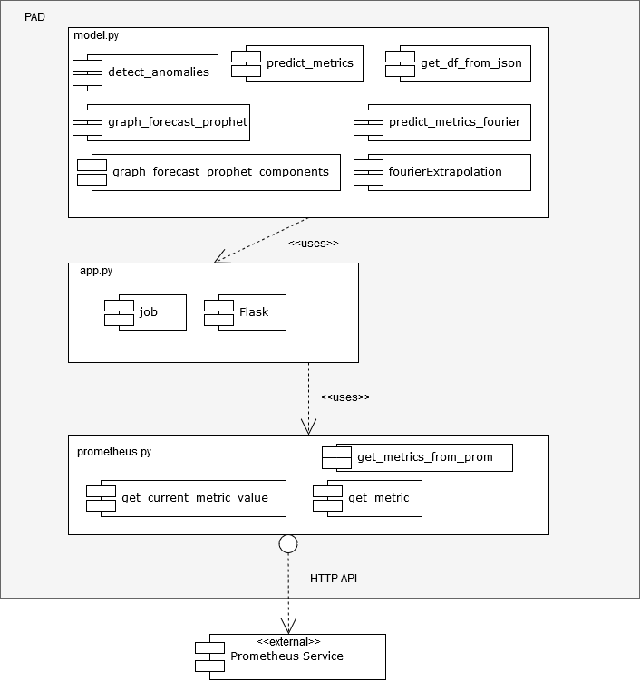
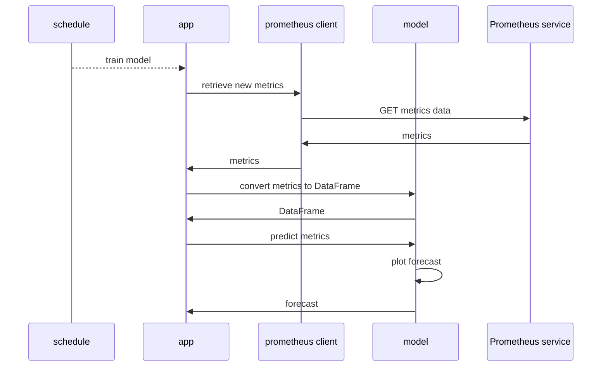
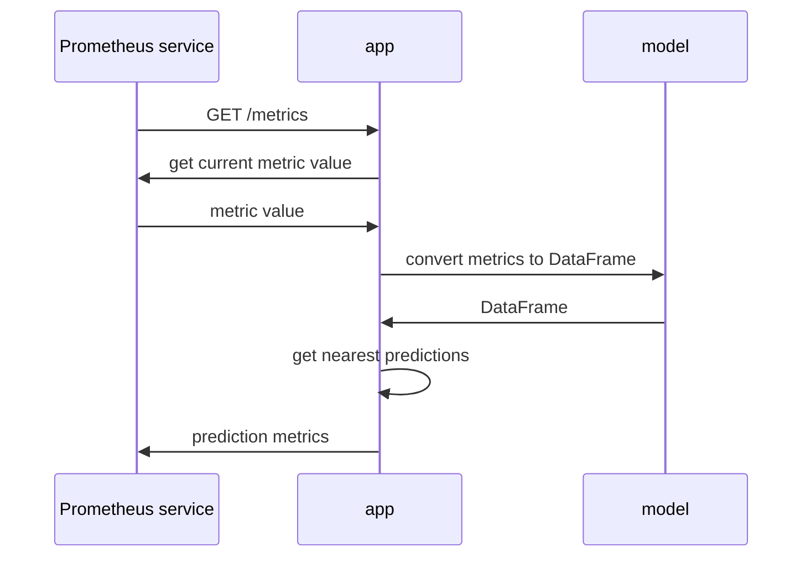
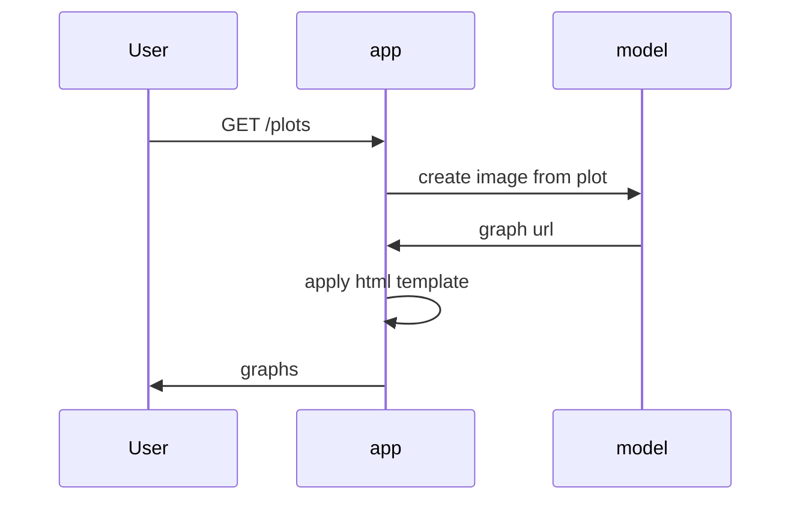
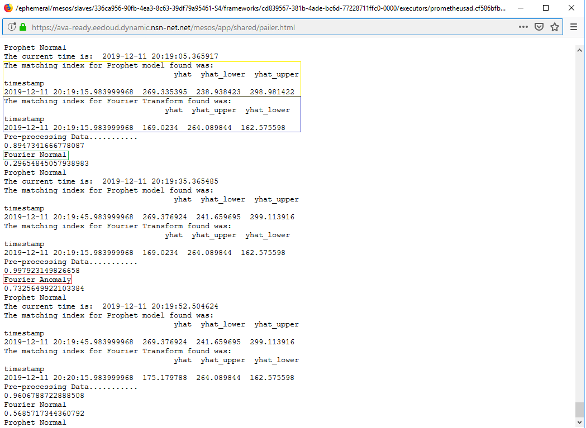
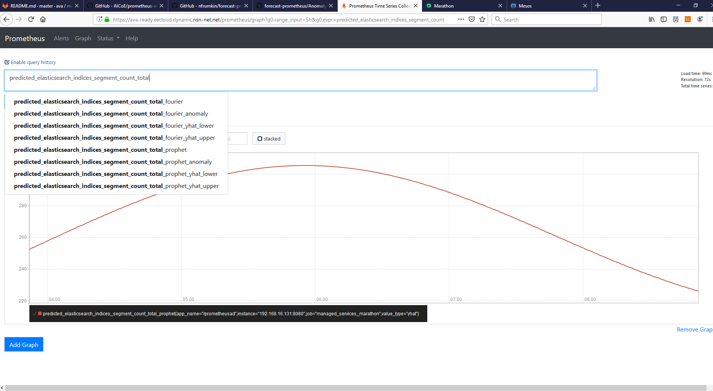
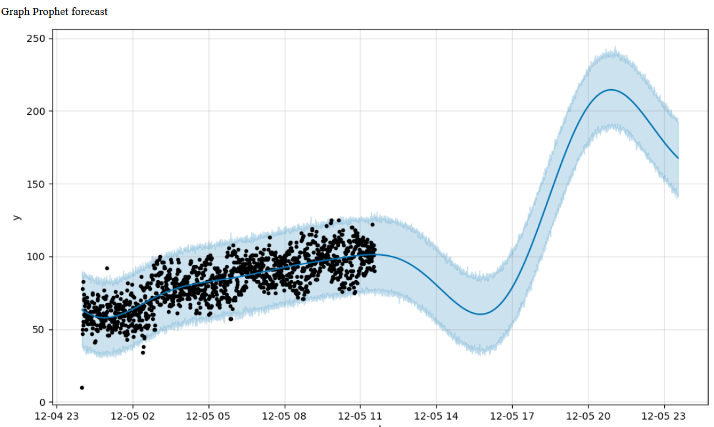
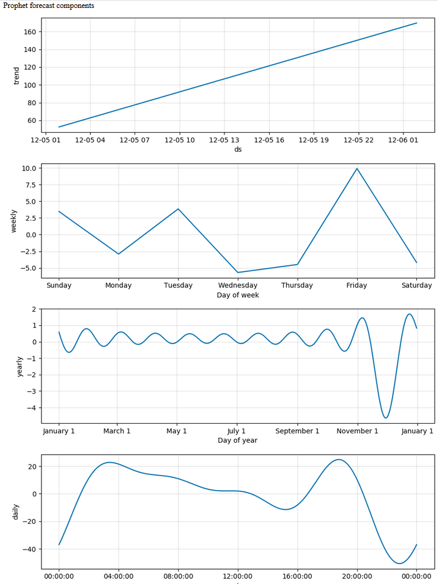

<!-- # train-prometheus
A simple application to collect data from a prometheus host and train a model on it -->

# Description

This repository contains Prometheus Anomaly Detector (PAD) -application. This application will provide time-series forecasts on Prometheus metrics, and compare the predicted values with actual values. PAD will detect anomaly data and flag it as anomaly, if the actual metric values are out of the boundaries of predictions.

PAD leverages machine learning algorithms of two types, Fourier Extrapolation and Prophet. The metrics data will be run through both algorithms and predictions are generated for each one independently. The output of the predicitons are 6 different metrics, which are then scraped by Prometheus Service Discovery from Flask web server the application is hosting.

This application will provide two graphs of the forecast, on the Flask web server endpoint.

Currently this application is Minimum Viable Product (MVP). 

# Overview of architecture





## Schedule training

 
When the app is started and on `PIIP_CONF` interval, the model is trained.

 



 

## Serving metrics

 

Application exposes `/metrics` endpoint for Prometheus to scrape.

 



 

## Serving plots in UI

 

After application is started and model is trained the application serves prediction plots as HTML page in `/plots` endpoint.

 




## Environment variables

The required variables will be used to communicate with the Prometheus, and configuring the training of the models.
Some of the variables has default values, but should be set to specific ones by the developer depending on the use case, and the metric that is being monitored. The table below contains all the environmental variables that exists and their default values:


|Name|Default|Description|
|:---|:------|:----------|
|METRIC_NAME|`None`|Metric name to be forecasted|
|LABEL_CONFIG|`None`|Label values of a specific metric|
|PROMETHEUS_URL|`None`|Prometheus host URL|
|CHUNK_SIZE|`1h`|download the complete data in smaller chunks, should be less than or equal to DATA_SIZE|
|DATA_SIZE_HOUR|`12h`|Net data size to scrape from prometheus|
|TRAINING_REPEAT_HOURS|`3h`|Iteration time that the model will be retrained|
|PREDICTION_RANGE|`180`|Range of predictions from the current time as minutes|
|HTTPS_PROXY|`http://fihel1d-proxy.emea.nsn-net.net:8080`|Proxy host URL|

## Running docker container on a local machine (standalone mode)

Finding your credantials and URL of your Prometheus host, run the following command to run the application:

```
docker run -e URL=https://<username>:<password>@<FQDN> -e METRIC_NAME=<metric name> -e LABEL_CONFIG=<label configuration>
```

Notice: Label configuration has to be in the following format (if the label configuration is copied from Prometheus UI, "__name__" key-value pair has to be specified manually): 

```
{'__name__': 'elasticsearch_indices_segments_count', 'cluster': 'es-cluster-avaespoo2', 'es_client_node': 'true', 'es_data_node': 'true', 'es_ingest_node': 'true', 'es_master_node': 'true', 'host': '192.168.7.126', 'instance': 'elasticsearchexporter-monitoring.marathon.mesos:9108', 'job': 'elasticsearch', 'name': '03fbd491de77'}
```

The following environmental variables can be also set in the same way (the example docker run command contains the mandatory variables to be set for the application to work): METRIC_NAME, LABEL_CONFIG

After the container is running, you can access the forecast plots from ```localhost:8080/plots```. More about plots in ```Visualisation of predictions``` -section.


## Running on Marathon

1. Connect to your Dev PaaS Marathon UI
2. Click ```Create application```
3. Switch into JSON mode, and copy the template below
4. Set atleast ```URL```, ```METRIC_NAME``` and ```LABEL_CONFIG``` environment variables from the deployment configuration of Marathon UI (switch off from JSON mode)

```
{
  "id": "/prometheusad",
  "cmd": null,
  "cpus": 3,
  "mem": 3072,
  "disk": 0,
  "instances": 1,
  "constraints": [
    [
      "hostname",
      "UNIQUE"
    ]
  ],
  "acceptedResourceRoles": [
    "*"
  ],
  "container": {
    "type": "DOCKER",
    "docker": {
      "forcePullImage": true,
      "image": "ava-docker-local.esisoj70.emea.nsn-net.net/ava/monitoring/metric-based-anomaly-detection:0.1.3",
      "parameters": [
        {
          "key": "log-opt",
          "value": "labels=app"
        },
        {
          "key": "label",
          "value": "app=prometheusAD"
        },
        {
          "key": "label",
          "value": "namespace=ava-system"
        }
      ],
      "privileged": false
    },
    "volumes": [],
    "portMappings": [
      {
        "containerPort": 8080,
        "labels": {
          "metrics": "/metrics"
        },
        "name": "default",
        "protocol": "tcp",
        "servicePort": 10044
      }
    ]
  },
  "healthChecks": [
    {
      "gracePeriodSeconds": 300,
      "intervalSeconds": 60,
      "maxConsecutiveFailures": 3,
      "path": "/metrics",
      "port": 8080,
      "protocol": "MESOS_HTTP",
      "ipProtocol": "IPv4",
      "timeoutSeconds": 20,
      "delaySeconds": 15
    }
  ],
  "labels": {
    "prometheusAD": "0.1.2"
  },
  "networks": [
    {
      "name": "cilium-net",
      "mode": "container"
    }
  ],
  "portDefinitions": []
}
```

## Creating route to the prediction graphs

When the application is deployed on Marathon, in order to display visualisation, a route to plots end point has to be created manually. 

You can create the route through the following steps:

1. Find out the IP address of the instance that the application is running

2. Connect to the instance through SSH using the following command: ssh -i private-key.pem root@172.16.0.12 -o ProxyCommand="ssh -W %h:%p root@10.129.214.183 -o StrictHostKeyChecking=no -o UserKnownHostsFile=/dev/null -o IdentityFile=private-key.pem" ('private-key.pem' in the example is the secret key for Smoke Dev PaaS, used by the Andromeda team)

3. Execute the following command ```curl -X POST server-kong.marathon.mesos:8001/apis/ -d 'name=prometheusd' -d 'upstream_url=prometheusad.marathon.mesos:8080/plots' -d 'uris=/plots' -d 'strip_uri=true'```

4. Connect to ```https://<FQDN>/plots``` (/plots)
 

## PAD usage

The use case for this framework is to support teams in real-time anomaly detection of their system components. The time series forecasts can be used by developers to detect unexpected behaviour of metrics. However, the developer should have domain expertise on the monitored metric, thus identify the importance/criticality of detected anomalies. Alerting of anomaly data is not automated. 

Currently PAD can be used for monitoring one instance of a metric at a time. As previously mentioned, as a user, you are required to specify ```LABEL_CONFIG``` of a metric that the model will be trained on.

### Inspecting logs

When you have successfully launched PAD on Marathon, the logs will be accessible via Mesos. The log output is explained with the picture below.



Inside the yellow box is Prophet predicted value (yhat), prediction upper limit (yhat_upper) and prediction lower limit (yhat_lower)

Inside the blue box is Fourier predicted value (yhat), prediction upper limit (yhat_upper) and prediction lower limit (yhat_lower)

If the current metric value is what is expected, the application will print the text as shown inside the green box

If the current metric value is considered as anomaly, the application will print the text as shown inside the red box


### Prometheus UI

After the model has been trained, PAD will expose the predictions as new metric values for Prometheus to scrape through Prometheus Service Discovery automatically.

See the picture below of the metrics provided to Prometheus




## Visualisation of predictions

After the route is created to ```PAD_ENDPOINT```, the model plots should be available at ```https://<FQDN>/plots``` (working PaaS environment)

Currently the end-point will provide 2 different graphs of the model, ```fbprophet.plot()``` and ```fbprophet.plot_components()```








Official documentation: https://facebook.github.io/prophet/docs/quick_start.html#python-api

## Anomaly detection rules

PAD is using two types of detection rules:

1. Tail probability
2. The Accumulator

The variation between forecast and real data can be because of three reason; the data is anomalous, data is very noisy, or the predictions are not good enough. As a developer, we are concerned if the data is anomalous.

The accumulator detection rules is based on the assumption that anomalous data is persistent. Rather than detecting anomalies point-wise, we have a running counter which increments when a point is flagged as anomalous and decremenets by 2 when a normal point is detected. If the counter reaches a certain threshhold value, then we raise a flag.

Tail probability anomaly detection rule uses the idea that the recent past's noise is comparable to the current noise. Using the gaussian noise assumption, we calculate the tail probability that that the mean of the current values is comparable to the values in the recent past.


## Metrics end point on Flask server

Following is a sample Flask end-point page view of what the metrics will look like:
```
# HELP process_virtual_memory_bytes Virtual memory size in bytes.
# TYPE process_virtual_memory_bytes gauge
process_virtual_memory_bytes 13.0
# HELP process_resident_memory_bytes Resident memory size in bytes.
# TYPE process_resident_memory_bytes gauge
process_resident_memory_bytes 31.0
# HELP process_start_time_seconds Start time of the process since unix epoch in seconds.
# TYPE process_start_time_seconds gauge
process_start_time_seconds 15.25
# HELP process_cpu_seconds_total Total user and system CPU time spent in seconds.
# TYPE process_cpu_seconds_total counter
process_cpu_seconds_total 69.88
# HELP process_open_fds Number of open file descriptors.
# TYPE process_open_fds gauge
process_open_fds 60.0
# HELP process_max_fds Maximum number of open file descriptors.
# TYPE process_max_fds gauge
process_max_fds 14.0
# HELP python_info Python platform information
# TYPE python_info gauge
python_info{implementation="CPython",major="3",minor="6",patchlevel="5",version="3.6.5"} 1.0
# HELP predicted_values_prophet Forecasted value from Prophet model
# TYPE predicted_values_prophet gauge
predicted_values_prophet{app_name="/prometheusad",instance="192.168.16.131:8080",job="managed_services_marathon",value_type="yhat"} 32.99
# HELP predicted_values_prophet_yhat_upper Forecasted value upper bound from Prophet model
# TYPE predicted_values_prophet_yhat_upper gauge
predicted_values_prophet_yhat_upper{app_name="/prometheusad",instance="192.168.16.131:8080",job="managed_services_marathon",value_type="yhat_upper"} 36.728885
# HELP predicted_values_prophet_yhat_lower Forecasted value lower bound from Prophet model
# TYPE predicted_values_prophet_yhat_lower gauge
predicted_values_prophet_yhat_lower{app_name="/prometheusad",instance="192.168.16.131:8080",job="managed_services_marathon",value_type="yhat_lower"} 27881.58691175386
# HELP predicted_values_prophet_anomaly Detected Anomaly using the Prophet model
# TYPE predicted_values_prophet_anomaly gauge
predicted_prophet_anomaly{app_name="/prometheusad",instance="192.168.16.131:8080",job="managed_services_marathon",value_type="Normal"}
predicted_prophet_anomaly{app_name="/prometheusad",instance="192.168.16.131:8080",job="managed_services_marathon",value_type="Anomaly"}
# HELP predicted_values_fourier_anomaly Detected Anomaly using the Fourier model
# TYPE predicted_values_fourier_anomaly gauge
predicted_fourier_anomaly{app_name="/prometheusad",instance="192.168.16.131:8080",job="managed_services_marathon",value_type="Normal"}
predicted_fourier_anomaly{app_name="/prometheusad",instance="192.168.16.131:8080",job="managed_services_marathon",value_type="Anomaly"}
# HELP predicted_values_fourier Forecasted value from Fourier Transform model
# TYPE predicted_values_fourier gauge
predicted_values_fourier{app_name="/prometheusad",instance="192.168.16.131:8080",job="managed_services_marathon",value_type="yhat"} 29838.64724605837
# HELP predicted_values_fourier_yhat_upper Forecasted value upper bound from Fourier Transform model
# TYPE predicted_values_fourier_yhat_upper gauge
predicted_values_fourier_yhat_upper{app_name="/prometheusad",instance="192.168.16.131:8080",job="managed_services_marathon",value_type="yhat_upper"} 37111.31044977396
# HELP predicted_values_fourier_yhat_lower Forecasted value lower bound from Fourier Transform model
# TYPE predicted_values_fourier_yhat_lower gauge
predicted_values_fourier_yhat_lower{app_name="/prometheusad",instance="192.168.16.131:8080",job="managed_services_marathon",value_type="yhat_lower"} 29739.05799347848
```
Source of this repository code: https://github.com/AICoE/prometheus-anomaly-detector-legacy

## Open source components

* [fbprohphet](https://github.com/facebook/prophet) - Facebook's timeseries forecasting library
* [requests](http://docs.python-requests.org/en/master/) - HTTP Library for python
* [boto3](https://boto3.readthedocs.io/en/latest/reference/core/session.html) - AWS sdk for python
* [pandas](http://pandas.pydata.org/) - High Performance Data Structure
* [flask](http://flask.pocoo.org/) - A lightweight web application framework
* [apscheduler](https://apscheduler.readthedocs.io/en/latest/) - Python Scheduling library
* [prometheus_client](https://github.com/prometheus/client_python) - Official Python client for Prometheus
* [sortedcontainers](http://www.grantjenks.com/docs/sortedcontainers/) - Pure python sorted simple data structures
* [Anomaly Detection](https://github.com/nfrumkin/forecast-prometheus/blob/master/anomaly_detector.py) - Anomaly Detection Function by Natasha Frumkin
* [Fourier Extrapolation Model](https://github.com/nfrumkin/forecast-prometheus/blob/master/fourier_train.py) - Fourier Extrapolation Model by Natasha Frumkin
* [Serving Prometheus Metrics](https://github.com/hemajv/flask-prometheus/blob/master/servicemetrics.py) - Flask Server to host Prometheus metrics by Hema Veeradhi


